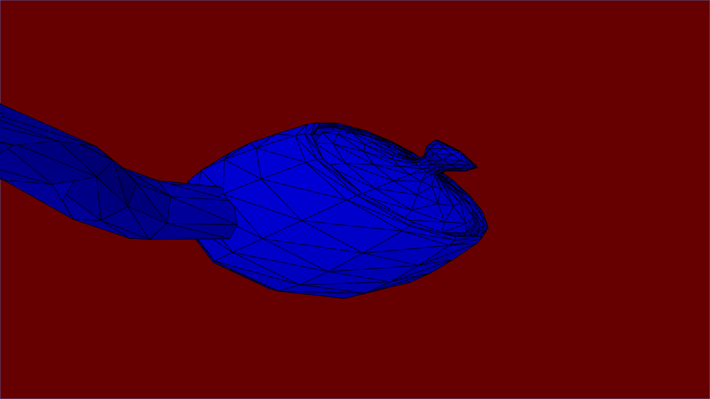
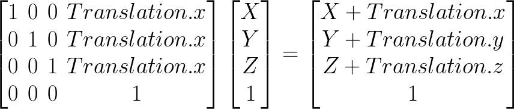
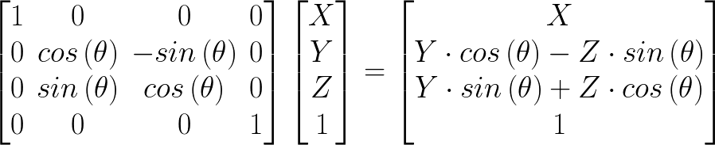
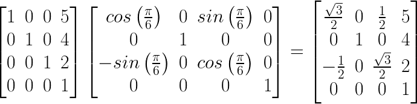
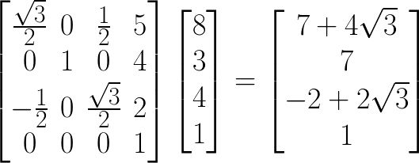

# Graphics

3D Graphics implemented from scratch, for fun. I wrote a linear algebra library from scratch then implemented it in a Scala.js project to create an [interactive online demo](https://anubiann00b.github.io/3D-Graphics-From-Scratch).

This was my final project for Linear Algebra at Bellevue College. Check out my [presentation slides](https://docs.google.com/presentation/d/1g4EpVgR5TG7khKvMejvNLPjuj-Lxkps9VCQrgyL75dc/edit?usp=sharing).



## Controls

 * WASD and Shift/Space to translate the model in space
 * Arrow keys to rotate the model about the X and Y axis
 * F to toggle to display of the faces
 * M to toggle the display of the mesh

## Building

```
sbt frontend/fullOptJs
```

Then host a local webserver:

```
python -m SimpleHTTPServer 8080
```

And navigate to `localhost:8080`

To run tests, you need [PhantomJS](http://phantomjs.org/download.html).

## Description

The [slides](https://docs.google.com/presentation/d/1g4EpVgR5TG7khKvMejvNLPjuj-Lxkps9VCQrgyL75dc/edit?usp=sharing) have more information and images.

We start with coordinates in **model space**. These coordinates are from our actual 3D models and all the points are relative to the model and often within [-1,1]. From these coordinates, we need to put each model at it's position and orientation into **world space**. We use simple matrix transformations for this. These transformations can be combined by simply multiplying them together, giving us a single matrix for all the combined model space -> world space transformations for each object. Here are a couple of our transformation matrices:

Translation


Rotation About X


A combination of a rotation about Y by 30 degrees followed by a translation by (5,4,2).


An application of that combined transformation on the point (8, 3, 4).


From there, we need to convert world space into **view space**. This is just the world space relative to the camera position and orientation. For our next step, we need the world relative to a camera looking down the Z axis. This is just a matter of translation and rotation to make the world axes match the required camera axes. However, this demo currently does not actually do this transformation, instead just transforming an object in front of the camera at the default position.

Once we get to view space, we need to get our **projection space**. This is just a cube with each axis in [-1,1] with a camera perspective in the shape of a frustum. Essentially, this is just giving closer objects more screen real estate than further objects, like our eyes or a camera in the real world. This can be done with a single complicated matrix transformation:


From projection space, we go to **screen space**, which is just flattening that cube, and scaling it to the screen dimensions. Screen space can be drawn directly on the screen!

We did it! We took a 3D model, placed in a location and orientation in our world, and rendered it to a 2D screen!

Note: Color is determined by just using the vertex normals from the model. The X and Y components of the face normals are taken and their combined magnitude is the intensity of the color. In [the code](https://github.com/anubiann00b/Graphics/blob/gh-pages/module_frontend/src/main/scala/me/shreyasr/graphics/App.scala#L102), the vertex normals are summed to get the face normal.

## Project

The `module_model` module contains the linear algebra library, and the `module_frontend` module contains the website code.

Here are a handful of important files:
 * [Vec.scala](module_model/shared/src/main/scala/me/shreyasr/graphics/Vec.scala)

All the code for the Vector class. Vectors are represented as a simple array of Floats.

 * [Mat.scala](module_model/shared/src/main/scala/me/shreyasr/graphics/Mat.scala)

All the code for the Matrix class. Matrices are represented as an array of floats with a number representing the number of columns. The companion object in this file contains a bunch of methods to create special matrices (such as the [identity matrix](module_model/shared/src/main/scala/me/shreyasr/graphics/Mat.scala#L169), a [translation matrix](module_model/shared/src/main/scala/me/shreyasr/graphics/Mat.scala#L121), and a [perspective projection matrix](module_model/shared/src/main/scala/me/shreyasr/graphics/Mat.scala#L90), among others).

 * [Engine.scala](module_model/shared/src/main/scala/me/shreyasr/graphics/Engine.scala)

This object contains all the methods to apply transformations onto an array of vectors.

 * [VectorTest.scala](module_model/shared/src/test/scala/VectorTest.scala) and [MatrixTest.scala](module_model/shared/src/test/scala/MatrixTest.scala)

Tests for the Mat and Vec classes. These were used throughout development to avoid having to rebuild the website every code change. The tests can run on PhantomJS, saving a lot of time and energy.

 * [App.scala](module_frontend/src/main/scala/me/shreyasr/graphics/App.scala)

This is the code for the actual website. It's transpiled to Javascript using [Scala.js](https://www.scala-js.org/).
